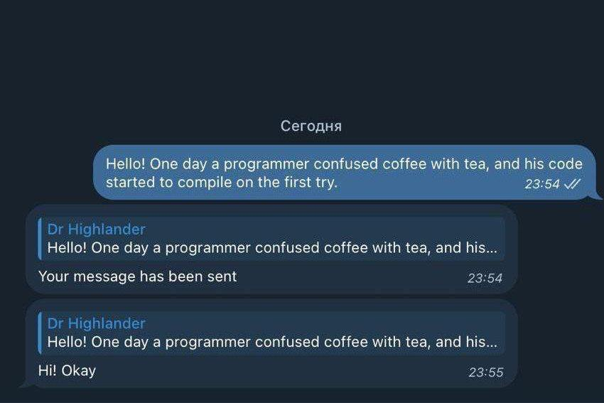
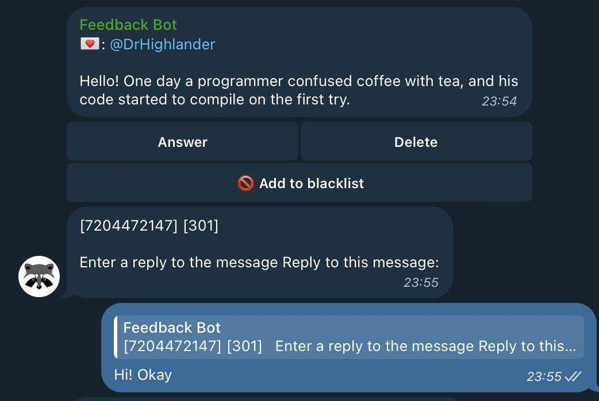

# Telegram Feedback Bot

<div align="left">
    <a href="README.md"></a>
    <a href="README_RU.md"></a>
</div><br>

Feedback Bot — это Telegram-бот, предназначенный для сбора обратной связи и предоставления помощи. Этот бот создан с использованием Python и библиотеки `pytelegrambotapi`. Вы можете внести свой вклад в улучшение бота. Посетите нашу [страницу на GitHub](https://github.com/adam-kad/feedbackbot) для получения дополнительных сведений.

<div align="center">
    
    
</div>

## О боте
Этот бот не использует базу данных; вместо этого я стремился сделать его максимально простым в использовании. Для добавления пользователей в черный список я использовал файл JSON, но вы можете настроить это по своему усмотрению. Бот поддерживает как polling, так и webhook режимы.

## Требования
- Python 3.11+
- Poetry для управления зависимостями
- Библиотека `pytelegrambotapi`

## Установка

1. **Клонируйте репозиторий:**

    ```sh
    git clone https://github.com/adam-kad/feedbackbot.git
    cd feedbackbot
    ```

2. **Установите Poetry:**

    Следуйте инструкциям на [странице установки Poetry](https://python-poetry.org/docs/#installation).

3. **Установите зависимости:**

    ```sh
    poetry install
    ```

## Настройка

1. **Настройте вашего Telegram-бота:**

    - Создайте нового бота с помощью [BotFather](https://core.telegram.org/bots#botfather) и получите токен вашего бота.
    - Создайте файл с именем `.env` в директории `feedbackbot/config` и добавьте в него токен бота и другие настройки конфигурации:

        ```env
        TELEGRAM_BOT_TOKEN=your_bot_token_here
        TELEGRAM_WEBHOOK_URL=https://your-webhook-url-here
        TELEGRAM_WEBHOOK_PORT=8000
        TELEGRAM_GROUP_ID=-2323434
        ```

2. **Настройте webhook (необязательно):**

    - Если вы разрабатываете локально и хотите использовать вебхуки, вам нужно открыть ваш локальный сервер для интернета. Вы можете использовать [ngrok](https://ngrok.com/) для этой цели. Скачайте и установите ngrok, затем выполните:

      ```sh
      ngrok http 8000
      ```

    - Используйте сгенерированный URL от ngrok в качестве `TELEGRAM_WEBHOOK_URL` и `TELEGRAM_WEBHOOK_PORT` в файле `.env`.

## Использование

1. **Запустите бота в режиме polling:**

    ```sh
    poetry run python -m bot.main
    ```

2. **Запустите бота в режиме webhook:**

    ```sh
    poetry run python -m bot.main --webhook
    ```

## Сотрудничество

Мы приглашаем вас внести свой вклад и помочь улучшить этот бот.

## Лицензия

Этот проект лицензирован на условиях MIT License. См. файл [LICENSE](LICENSE) для получения подробной информации.

С наилучшими пожеланиями, Feedback Bot
